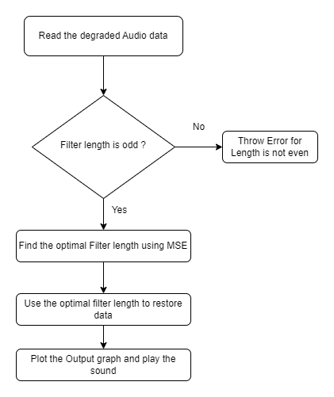
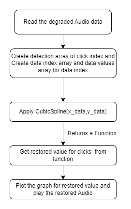
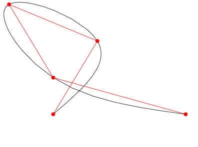
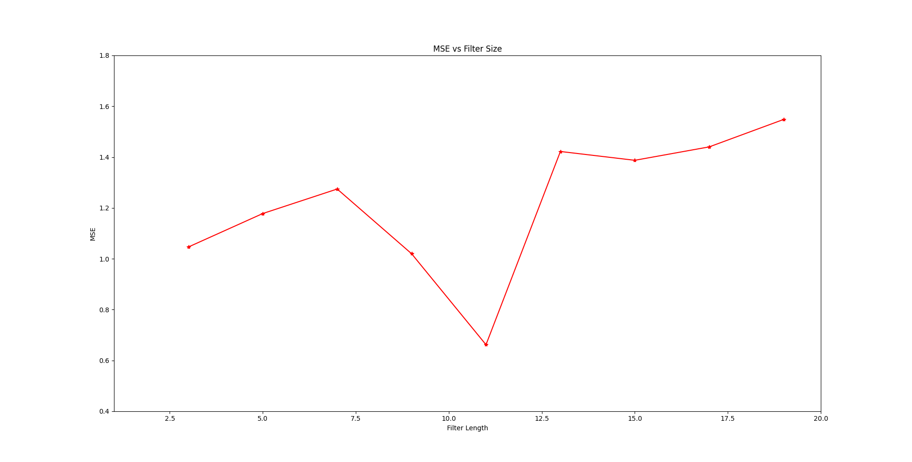
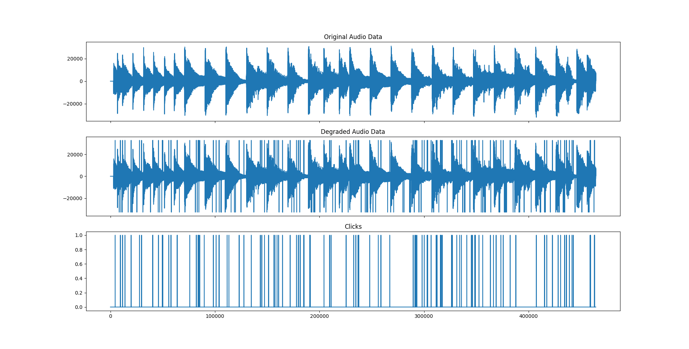
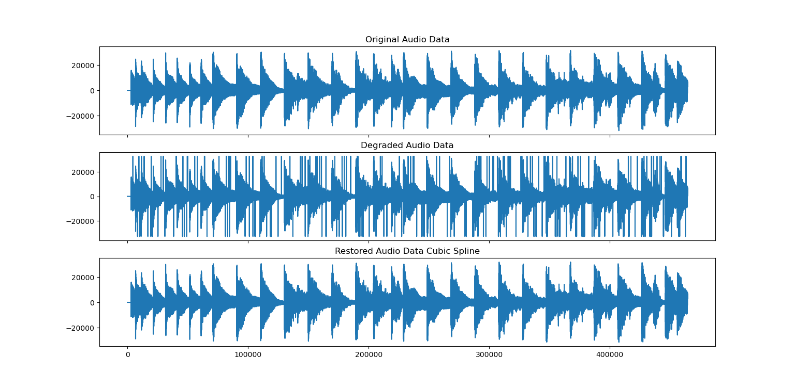

# Audio Restoration Using Median and Cubic Spline Interpolation Methods

## Description of the project
This Assignment is about removing  the clicks from the Audio signal using median filter and cubic spline interpolation techniques.
- median filtering
It is a non-linear filter based on the principle of removing out liners using simple median technique. Although it 
does not remove all the spikes, but removes considerable noise from the audio signal.

The median M of a set of values divides the set into two equally
sized halves, so that as many values are smaller than M as there are
values larger than M. If we consider a sorted list of N values x(n),
N odd, the median M is simply the middle element x(N−1/2). It is
related to the mean value, but shows some important differences.[[1]](#1)

The main differences between the median and the mean value are 
- cubic splines
A cubic spline is a spline constructed of piecewise third-order polynomials which pass through a set of m control points. The second derivative of each polynomial is commonly set to zero at the endpoints, since this provides a boundary condition that completes the system of m-2 equations. This produces a so-called "natural" cubic spline and leads to a simple tri-diagonal system which can be solved easily to give the coefficients of the polynomials. However, this choice is not the only one possible, and other boundary conditions can be used instead.[[2]](#2)
It is another technique of interpolation based on principles of polynomials with control points called as "Knots".
It computes the line from third order piecewise cubic function, which interpolates data points between knots and provide more smoothness for the signal.
---

## Installation and Execution

Provide details on the Python version and libraries (e.g. numpy version) you are using. One easy way to do it is to do that automatically:
```sh                                 
pip3 install pipreqs

pipreqs $project/requirements.txt
```
For more details check [here](https://github.com/bndr/pipreqs)


After installing all required packages you can run the demo file simply by typing:
```sh
python Audio_restoration.py
python cubic_spline.py
```
---

## Methodology and Results

* Median Filter:

Flow chart Median Filter code:



Step 1:
Read the original Audio and degraded File using wave file functions
Also store only one channel data into a array. We don't require the 2 channels data.
plot the original and degraded data using matplotlib

Step 2:
Now, we can figure out the clicks on the graph. Created a data array called "Detect".
Detect has '1' for every click and '0' for rest audio data.
Plot the clicks graph as well.

Step 3:
median filter implementation:
The algorithm is very simple, just passing the array of previous and next audio data based on considering the click as median.
```sh
For example click is at index = 7. input to the median filter is [ 7 - Padding_data : 7 + Padding_data ]
where as length of Padding_data depends on the provided filter length. 
For,
Filter length 3 padding data required is 1 
for filter length 5 Padding data required is 2 and so on..
```

The filter will sort this input in ascending order.
It will return the median from the array.
Now, replace the click value with the median value computed

Step 4:
Get the best value for filter length. Considered the value from 3 to 19 and computed the MSE for each of the 
filter length.
Plot the graph of MSE against the filter length. 
'get_filter_len' will return the best filter length for the audio data.

Step 5:
Now, using the filter length, restore the data from the median filter function.
Plot the output data file.

Step 6:
write the output data into the 'output.wav' file and play the sound

step 7:
Perform unit test to check the median filter function works using unittest

* CubicSpline:

Flow Chart for Cubic Spline:



class scipy.interpolate.CubicSpline(x, y, axis=0, bc_type='not-a-knot', extrapolate=None)
Parameters : x (array)
             y (array)
             axis (optional) along which y is assumed to be varying
             bc_type(optional) boundary condition
             extrapolate(optional)[[2]](#2)



Step 1:
Read the original Audio and degraded File using wavefile functions
Also, store only one channel data into a array. We don't require the 2 channels data.
Plot the original and degraded data using matplotlib

Step 2:
Creating a detection array of clicks from degraded audio data. Plot the original, degraded and click data.

Step 3:
Compute the indexes having clicks from Degraded Data and remove it.
Store the indexes contains data in 'x_data'.
Compute the audio data other than click indexes and store it in 'y_data'.

step 4:
Use CubicSpline function to get the function which returns the values of missing points.

Step 5:
loop through the length of clicks to extract the interpolated values, store it 'data_n'

Step 6:
write the output data into the 'output.wav' file and play the sound


**Results**

1. For the median filter, different filter lengths were explored to find the quality of the restoration and their MSE Errros. The below figure is of MSE against the Filter length. 
The degraded audio file used is <[Degraded_Audio.wav](https://github.com/AtulRedekarTCD/Computational/tree/local/Assignment02/degraded.wav)>



From the graph it is seen that optimal filter length is : 11 for lowest MSE '0.6'
The comparison over the original, degraded and restored data.



The restored data is converted as Audio File <[Restored_Median_Filter.wav](https://github.com/AtulRedekarTCD/Computational/tree/local/Assignment02/output_median_filter.wav)>

The Below Figure shows the original, degraded and restored Sound data by Median filter.


2. cubic spline is implemented in cubic_spline.py 
The MSE for cubic_spline is '0.4'.
The execution time for Cubic spline function is 4-5 secs.
The Below Figure shows the original, degraded and restored Sound data by Cubic Spline.



The restored data is converted as Audio File <[Restored_CubicSpline.wav](https://github.com/AtulRedekarTCD/Computational/tree/local/Assignment02/output_cubic_spline.wav)>


3. Comparing the median Filter and Cubic Spline interpolation methods, we can conclude that CubicSpline achieves a lower MSE than the median filter. The runtime of Median Filter method is 6-7 secs, whereas for cubic spline it is 4-5 secs. 

After listening to the both restored files, I notice that Cubic spline is slightly better than the median filter, which justifies because, MSE for cubic is lower that the Median filter.


## Credits

This code was developed for purely for academic purposes by Atul Redekar github profile name - 'AtulRedekarTCD' as part of the module computational Module.

## Resources
- <a id="1">[1]</a> EFFICIENT DSP IMPLEMENTATION OF MEDIAN FILTERING FOR REAL-TIME AUDIO
NOISE REDUCTION, Stephan Herzog Dept. of Digital Signal Processing Technical University Kaiserslautern Kaiserslautern, Germany Proc. of the 16th Int. Conference on Digital Audio Effects (DAFx-13), Maynooth, Ireland, 
- <a id="2">[2]</a> Cubic Spline mathematical expressions https://mathworld.wolfram.com/CubicSpline.html
- <a id="3">[3]</a> For Implementation of CubicSpline https://docs.scipy.org/doc/scipy/reference/generated/scipy.interpolate.CubicSpline.html 